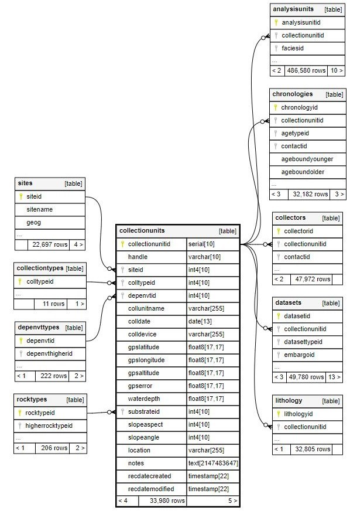

<style type="text/css">
h2, h3, h4, h5, h6 {
  counter-reset: section;
}
p {
  font-size:18px;
}

ul {
  font-size:18px;
}

li {
  font-size:18px;
}
table {
   padding: 0;border-collapse: collapse;
   layout: fixed;
   width: 90%; }
table tr {
   border-top: 1px solid #cccccc;
   background-color: white;
   margin: 0;
   padding: 0; }
table tr:nth-child(2n) {
   background-color: #f8f8f8; }
table tr th {
   font-weight: bold;
   border: 1px solid #cccccc;
   margin: 0;
   padding: 6px 13px; }
table tr td {
   border: 1px solid #cccccc;
   margin: 0;
   padding: 6px 13px; }
table tr th :first-child, table tr td :first-child {
   margin-top: 0; }
table tr th :last-child, table tr td :last-child {
   margin-bottom: 0; }
.html-widget {
    margin: auto;
}
</style>

---

```{r setup, include=FALSE}
knitr::opts_chunk$set(echo = TRUE)
```

# Introducción
La Base de Datos de Paleoecología Neotoma permite a los usuarios generar nuevos conocimientos paleobiológicos a través de la curaduría de miles de conjuntos de bases de datos paleo y los metadatos asociados. El alcance de los metadatos que Neotoma conserva puede no ser obvio para sus usuarios, porque no toda la información está disponible en la aplicación de Neotoma Explorer, o incluso en las funciones proporcionadas por el paquete de R ```neotoma2```. Si usted no está familiarizado con un paleoregistro, entonces es especialmente importante que se familiarice con sus metadatos para asegurarse de que entiende los datos con los que está trabajando.

Este tutorial le mostrará cómo explorar más de estos extensos metadatos, centrándose en el sitio y la ubicación del núcleo. Al final de este tutorial, usted deberá ser capaz de 

<ul>
<li>comprobar si un yacimiento en Neotoma está almacenado como un punto o como un polígono </li>
<li>entender la diferencia entre la tabla de sitios de Neotoma y la tabla de unidades de colección, y </li>
<li>utilizar la visualización del esquema Abierto de Neotoma para buscar tablas de metadatos desconocidas.</li>
</ul>

# ¿Qué son los metadatos?
Antes de empezar a trabajar con los datos, definamos los metadatos. Los metadatos son datos sobre datos; contextualizan los datos, dándoles sentido y haciéndolos utilizables. Entre otras cosas, pueden referirse a la procedencia (¿quién recopiló los datos? ¿dónde?), el método (¿cómo se recopilaron los datos?), y la política y la ética (¿el proceso de recopilación de datos requirió un proceso de revisión? ¿Cómo se autoriza el uso de los datos?). Es importante tener en cuenta que la distinción entre datos y metadatos puede ser un poco resbaladiza: depende de la pregunta que se haga. Si está realizando un análisis de los porcentajes de polen a lo largo del tiempo en un sólo lugar, entonces los porcentajes de polen son sus datos, y las coordenadas del lugar son metadatos. Pero si está buscando en múltiples sitios cualquier muestra de polen de superficie con una proporción de Cyperaceae superior al 10%, entonces las coordenadas de su sitio son los datos.

# Obtención de datos
## Paquetes
En primer lugar, vamos a cargar algunos paquetes que necesitaremos.

```{r packages, warning=FALSE, message=FALSE}

library(neotoma2)
library(tidyverse)
library(DT)
library(geojsonsf)
library(sf)
library(leaflet)
library(jsonlite)
library(httr)

```

## Sitios de interés
Ahora que tenemos nuestros paquetes cargados, podemos escoger algunos sitios que nos interesan. Este tutorial asume que ya sabes cómo obtener datos a través del paquete de R ```neotoma2```. Si necesita un repaso, consulte este tutorial.

Buscaremos los sitios del lago Tanganica. Tomamos los sitios, y luego usamos la función ```neotoma2::plotLeaflet()``` para ver dónde están esos sitios.


```{r get-data, echo=TRUE, warning=FALSE}

tanganyikaSites = get_sites(sitename = "%Tanganyika%")


plotLeaflet(tanganyikaSites)
```

Encontramos cuatro sitios, y parecen estar situados a lo largo del centro del lago. Pero hay que tener cuidado. La función ```plotLeaflet()``` representará todos los sitios en Neotoma como puntos, incluso si las coordenadas de las geometrías de los sitios están realmente almacenadas en Neotoma como polígonos. En el modelo de datos de Neotoma, los sitios se refieren a las localidades generales de las que se extraen los paleodatos, pero no necesariamente constituyen las ubicaciones precisas en las que se toman los testigos. En el caso de un lago pequeño, puede que esto no suponga ninguna diferencia para su análisis. Pero en el caso de un gran lago como el Tanganica, la diferencia entre el centroid de un polígono y la ubicación real de los testigos puede ser significativa.

Afortunadamente, Neotoma a menudo almacena la información de la ubicación del núcleo en un objeto separado, la unidad de colección. Los sitios son los lugares donde tuvo lugar la recolección de datos en general, y las unidades de recolección son los materiales concretos que está analizando de un sitio - las unidades de recolección pueden ser núcleos, excavaciones, madrigueras, secciones, especímenes, etc. Más información sobre las diferencias entre sitios y unidades de colección pueden ser encontradas [aquí](https://open.neotomadb.org/neotoma2/inst/doc/neotoma2-package.html).

# Puntos y polígonos
Comprobemos si los objetos del yacimiento del lago Tanganica son realmente puntos o polígonos.

La función ```plotLeaflet()``` es una gran herramienta para comprender la localización general de un yacimiento, pero a veces puede inducirnos a pensar que un sitio está descrito con más precisión en Neotoma de lo que realmente está. Esto no siempre es un problema - a veces todo lo que necesitamos es la ubicación general del sitio. Pero si estamos tratando de ser cuidadosos sobre la ubicación del sitio - si, por ejemplo, estamos haciendo un análisis que es sensible a la variación espacial a pequeña escala - entonces vamos a querer obtener metadatos de Neotoma más oficiales sobre la ubicación del sitio. Podemos hacerlo a través de una de [las llamadas a la API de Neotoma](https://api.neotomadb.org/api-docs/).

Particularmente, vamos a utilizar una API que requiere un siteid de Neotoma, o una cadena de siteids separada por comas, como entrada. La salida de esta API serán metadatos de sitios y conjuntos de datos. En primer lugar, formatearemos los siteids de los sitios de Tanganica que encontramos anteriormente como una cadena separada por comas y, a continuación, los pegaremos en la llamada a la API concreta que nos gustaría realizar. Enviamos una petición ```GET()``` y descomprimimos la respuesta con la función ```content()```, centrándonos sólo en lo que hay bajo la cabecera data. Podemos mirar el principio de nuestra salida (que llamamos siteMetadata). 

```{r api-sites, echo=TRUE, warning=FALSE}


siteidString = paste0(as.data.frame(tanganyikaSites)$siteid,collapse=",")

apiCall = paste0('https://api.neotomadb.org/v2.0/data/sites/',siteidString,'/datasets')


response = GET(apiCall)

siteMetadata = content(response)$data


siteMetadata[[1]]$site[1:5]
```

siteMetadata es una lista de... bueno... metadatos de sitios. Incluso mirando las primeras entradas de esta lista, podemos ver que al menos un sitio que ```plotLeaflet()``` representó como un punto es en realidad un polígono. Pero la estructura de la lista es difícil de leer. Vamos a reorganizar esta lista como una tabla de datos, y por ahora, vamos a mantener sólo los metadatos del sitio, no los metadatos del conjunto de datos. Como sólo guardamos los metadatos del sitio, algunas de nuestras entradas estarán duplicadas; podemos guardar sólo las entradas distintas.


```{r metadata-to-table, warning=FALSE}

idx = 0

for (i in seq(length(siteMetadata))) {
  for (j in seq(length(siteMetadata[[i]]$site$datasets))) {
    idx = idx + 1
  }
}


siteMetadata_mat = matrix(nrow=idx,ncol=10)

idx2 = 0
for (i in seq(length(siteMetadata))) {
  for (j in seq(length(siteMetadata[[i]]$site$datasets))) {
    idx2 = idx2 + 1
    for (k in seq(10)) {
      if (!is.null(siteMetadata[[i]]$site[[k]])) {
        siteMetadata_mat[[idx2, k]] = siteMetadata[[i]]$site[[k]]
      }
    }
    
 
  }
}


siteMetadata_df = as.data.frame(siteMetadata_mat)

names(siteMetadata_df) = c("siteid","sitename","sitedescription","sitenotes","geography","altitude","collectionunitid","collectionunit","handle","unittype")


siteMetadata_df = distinct(siteMetadata_df)

#just first ten cols
datatable(siteMetadata_df[1:10],rownames=FALSE)

```

Observará que incluso después de eliminar las entradas duplicadas, tenemos once filas, pero sólo cuatro sitios. Esto se debe a que los metadatos bajo la cabecera del sitio también incluyen información sobre las unidades de colección -más sobre las unidades de colección en breve- y cada uno de estos sitios está asociado con entre 1 y 4 unidades de colección.

Antes de hablar de las unidades de colección con más detalle, vamos a mapear los nuevos metadatos de ubicación de los sitios, para comprobar si de hecho son puntos o polígonos. Para ello, utilizaremos la función ```geojson_sf()``` para convertir la columna geography de nuestro marco de datos siteMetadata_df en un objeto sf (características simples / simple features), y volveremos a vincular ese objeto sf al resto del marco de datos. A continuación, separaremos los sitios que tienen geometría de puntos (pointSites) de los que tienen geometría de polígonos (polySites), manteniendo sólo las filas con siteids distintos, y graficaremos ambos objecos en una figura leaflet.


```{r geo-revisited, warning=FALSE}


siteGeo_sf = geojson_sf(siteMetadata_df$geography)

siteMetadata_sf = cbind(siteGeo_sf,siteMetadata_df)

pointSites = siteMetadata_sf[st_geometry_type(siteMetadata_sf) == "POINT",] %>% distinct(siteid, .keep_all = TRUE)
polySites = siteMetadata_sf[st_geometry_type(siteMetadata_sf) == "POLYGON",] %>% distinct(siteid, .keep_all = TRUE)

leaflet() %>%
  addTiles() %>%
  addPolygons(data = polySites, 
              color = "red", 
              weight = 2, 
              fillColor = "orange", 
              fillOpacity = 0.15, 
              popup = ~sitename)  %>%
  addCircleMarkers(data = pointSites, 
                   radius = 5, 
                   color = "blue", 
                   fillColor = "blue", 
                   fillOpacity = 0.7, 
                   stroke = FALSE, 
                   popup = ~sitename)

```


¡Ajá! tres de nuestros cuatro sitios son de hecho polígonos, ¡no puntos! El objeto de sitio en Neotoma sólo puede delimitar la localidad en la que se ha llevado a cabo una investigación en los términos más generales.

Así que hemos aprendido que el sitio no nos da información precisa sobre la ubicación exacta de un registro polínico. Entonces, ¿dónde encontramos la información sobre la ubicación del núcleo? Resulta que tenemos que buscar en la tabla collectionunits, accesible a través de una API.

# La tabla collectionunits
La tabla collectionunits es el lugar al que acudir para conocer los metadatos específicos del núcleo, incluida la ubicación precisa del mismo. Si un sitio suele ser un lago o una turbera, la unidad de colección suele ser un único núcleo del sitio. Para acceder a las unidades de colección asociadas a nuestros sitios de Tanganica, primero tenemos que descargar toda la tabla de unidades de colección. A continuación, filtraremos las unidades de colección que nos interesen. Posteriormente, tomamos la tabla de unidades de recolección como una lista, la reorganizamos en un marco de datos y, a continuación, en un objeto sf, y la trazamos sobre nuestro mapa.

```{r collectionunits, warning=FALSE}


text="collectionunits"
collunits = content(GET(paste0('https://api.neotomadb.org/v2.0/data/dbtables/',text,'?count=false&limit=99999&offset=0')))$data


collunit_mat = matrix(nrow=length(collunits),ncol=20)

for (i in seq(length(collunits))) {
  for (j in seq(20)) {
    if (!is.null(collunits[[i]][[j]])) {
      collunit_mat[[i,j]] = collunits[[i]][[j]]
    }
  }
}

collunit_df = collunit_mat %>% as.data.frame()

names(collunit_df) = c("collectionunitid","handle","siteid","colltypeid","depenvtid","collunitname","colldate","colldevice","gpslatitude","gpslongitude","gpsaltitude","gpserror","waterdepth","substrateid","slopeaspect","slopeangle","location","notes","recdaterecreated","recdatemodified")


filtered_colls = collunit_df %>% dplyr::filter(collectionunitid %in% siteMetadata_df$collectionunitid) 
filteredColl_sf = collunit_df %>% dplyr::filter(collectionunitid %in% siteMetadata_df$collectionunitid) %>% st_as_sf(coords=c("gpslongitude","gpslatitude"), crs="WGS84")

#just first ten cols
datatable(st_drop_geometry(filteredColl_sf)[c(1:3,5:10,15)],rownames=FALSE)


pal <- colorFactor(palette = "Set1", domain = siteMetadata_df$siteid)


polySites$arranger =  cbind( 1/as.numeric(st_area(polySites)))
polySites = polySites %>% arrange(arranger)

leaflet() %>%
  addTiles() %>%
  addPolygons(data = polySites, 
              color = "black", 
              weight = 1, 
              fillColor = ~pal(siteid), 
              fillOpacity = 0.55, 
              popup = ~sitename)  %>%
  addCircleMarkers(data = pointSites, 
                   radius = 8, 
                   color = "black", 
                   fillColor = ~pal(siteid), 
                   fillOpacity = 0.7, 
                   stroke = TRUE, 
                   weight = 1,
                   popup = ~sitename)   %>% 
  addCircleMarkers(data = filteredColl_sf, 
                   radius = 3, 
                   color = "white", 
                   fillColor = ~pal(siteid), 
                   fillOpacity = 1, 
                   stroke = TRUE,
                   weight = 1,
                   popup = ~collunitname)

```


En el gráfico anterior, los sitios y los núcleos asociados aparecen en el mismo color. Los sitios tienen contornos negros y los núcleos tienen contornos blancos. Si hace clic en un sitio o núcleo, aparecerá su nombre. ¿Y qué le parece? A excepción del sitio «Lake Tanganyika [SD cores]» (nuestro único sitio puntual), no hay coincidencias entre la ubicación general del sitio y la ubicación del núcleo.

Esto plantea la pregunta: ¿a qué resolución espacial y para qué tipo de análisis empiezan a ser importantes estos desajustes? Véase esta [demostración](coordinatesMatter.html) como respuesta.

#  Exploración adicional de los metadatos de Neotoma
Pudimos encontrar información importante de ubicación del sitio al descargar toda la tabla collectionunits, y pudimos hacerlo porque sabíamos de la existencia de esta tabla. Pero Neotoma tiene un modelo de datos sofisticado - hay tablas con información relevante cuya existencia no vamos a conocer.

Por suerte, el modelo de datos de Neotoma es abierto, y está disponible para su exploración en Open Neotoma. Podemos utilizar este recurso para explorar más metadatos. Si, por ejemplo, quisiéramos ver qué otra información está conectada a nuestras unidades de colección, podemos navegar a la página en Open Neotoma sobre las tablas de unidades de colección. Esta página proporciona los nombres y definiciones de los campos de la tabla de unidades de colección y, si se desplaza hasta la parte inferior de la página, también puede ver con qué otras tablas están conectada con la tabla de unidades de colección a través de pares de claves primarias/externas.



Si quisiéramos saber más sobre el sustrato de nuestras unidades de colección, podríamos descargar la tabla rocktypes que vemos referenciada en esta página (usando la misma llamada a la API download-table de antes) y filtrar la tabla para los ids de sustrato relevantes de nuestras unidades de colección.

```{r further-explore}

text2="rocktypes"
rocktypes = content(GET(paste0('https://api.neotomadb.org/v2.0/data/dbtables/',text2,'?count=false&limit=99999&offset=0')))$data

rock_mat = matrix(nrow = length(rocktypes),ncol=6)
for (i in seq(length(rocktypes))) {
  for (j in seq(6)) {
    if (!is.null(rocktypes[[i]][[j]])) {
      rock_mat[i,j] = rocktypes[[i]][[j]]
    }
  }
}

rock_df = as.data.frame(rock_mat)

names(rock_df) = c("rocktypeid","rocktype","higherrocktypeid","description","recdatecreated","recdatemodified")

filtered_colls = filtered_colls %>% left_join(rock_df,by=join_by("substrateid" == "rocktypeid"))

datatable(filtered_colls[c(1,3,6,14,15,16,21,22,23)],rownames=FALSE)

```


Si lo hacemos, encontramos que el sustrato es arcilla o barro, limo o no está registrado. Supongo que no es demasiado sorprendente en el caso de los testigos de sedimentos.

#  Conclusión
A lo largo de este tutorial, hemos descubierto que los sitios de Neotoma del lago Tanganica se describen principalmente con polígonos, no con puntos, y hemos aprendido dónde encontrar información más precisa sobre la ubicación de los testigos de esos sitios. Por último, hemos explorado brevemente un recurso para descubrir aún más metadatos de Neotoma.

Esperamos que esta inmersión en los metadatos de Neotoma le anime a profundizar en el modelo de datos de Neotoma - ¡es un recurso muy rico! Si desea hacer algún comentario sobre este tutorial, llene este [formulario](https://docs.google.com/forms/d/e/1FAIpQLSf7aRsbQMa_hj2CKwcpGmF26Huk4MdP9pj5M7zcVF4K2d2zFQ/viewform?usp=sf_link).

<div class="tocify-extend-page" data-unique="tocify-extend-page" style="height: 0;"></div>