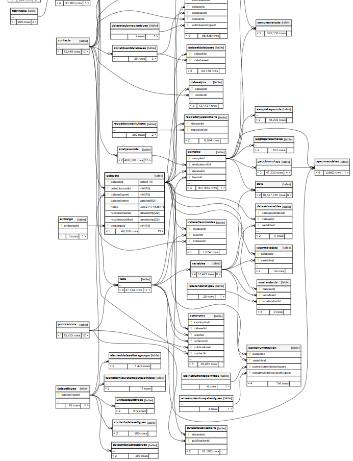

<style type="text/css">
h2, h3, h4, h5, h6 {
  counter-reset: section;
}
p {
  font-size:18px;
}

ul {
  font-size:18px;
}

li {
  font-size:18px;
}
table {
   padding: 0;border-collapse: collapse;
   layout: fixed;
   width: 90%; }
table tr {
   border-top: 1px solid #cccccc;
   background-color: white;
   margin: 0;
   padding: 0; }
table tr:nth-child(2n) {
   background-color: #f8f8f8; }
table tr th {
   font-weight: bold;
   border: 1px solid #cccccc;
   margin: 0;
   padding: 6px 13px; }
table tr td {
   border: 1px solid #cccccc;
   margin: 0;
   padding: 6px 13px; }
table tr th :first-child, table tr td :first-child {
   margin-top: 0; }
table tr th :last-child, table tr td :last-child {
   margin-bottom: 0; }
.html-widget {
    margin: auto;
}
</style>

---

```{r setup, include=FALSE}
knitr::opts_chunk$set(echo = TRUE)
```

# Introduction

This page will introduce the use of Neotoma APIs and describe some situations when they might be preferable to the use of the Neotoma2 R package.

```{r packages, warning=FALSE, message=FALSE,echo=FALSE}

library(neotoma2)
library(tidyverse)
library(DT)
library(geojsonsf)
library(sf)
library(leaflet)
library(httr)
library(jsonlite)
library(ggplot2)
library(analogue)
library(raster)
library(tmap)
library(rosm)
library(osmdata)
```

# What is an API?

An API (application programming interface) is a set of rules that allows different computers or computer components to communicate. One set of APIs enable a user's computer programs to access resources managed by the same computer's operating system. For example, a program might request memory through an API known as a system call. 

The APIs we're concerned with here are Web APIs. That is, they're APIs that use Web protocols like HTTP to enable communication between computers through the internet. Web APIs are fundamental to web-based information sharing.

## Neotoma APIs

There are a range of Neotoma APIs that can be accessed through this [page](https://api.neotomadb.org/api-docs/). When you call a Web API, it follows the HTTP protocol, which means you issue a request like GET, POST, or PUT, etc., and you receive a response. Let's see how we can make these API calls in R. We'll need to download the library ```httr```, which has those HTTP calls like ```GET()``` as well as a ```content()``` function that helps decode the response we receive.   

We'll make the following API call: https://api.neotomadb.org/v2.0/data/occurrences?taxonid=35619&limit=10. This call will return the first 10 occurrences within the Neotoma database of samples with taxon id 35619, which corresponds to <i>Canis spp.</i>. (How do I know this taxon id is the right one for Canis? See below!)

We want to wrap our call in the ```GET()``` function, and then decode the contents.

``` {r an-api}

firstAPI = GET("https://api.neotomadb.org/v2.0/data/occurrences?taxonid=35619&limit=10")

print(firstAPI)

```

Status: 200 is a good sign; that means the call issued successfully. Now we use ```content()``` to get the data. The output of ```content()```, called insides, has three components: status, data, and message. Most of the time, status will be "success", and message will be "retrieved all tables," so we mostly care about the data. But in case you're ever running int issues and need to debug, it can be helpful to consider what the status and message are.

``` {r an-api2}

insides = content(firstAPI)$data

print(insides[1])
```

We just successfully ran our first API! But the format we received is a little hard to work with...
```{r hidden, message=FALSE,warning=FALSE,echo=FALSE}


canis_mat = matrix(nrow=length(insides),ncol=12)
for (i in seq(length(insides))) {
  if(!is.null(insides[[i]]$occid)) {
    canis_mat[[i,1]] = insides[[i]]$occid
  }
  for (j in seq(4)) {
    if(!is.null(insides[[i]]$sample[[j]])) {
      canis_mat[[i,(1+j)]] = insides[[i]]$sample[[j]]
    }
  }
   for (k in seq(7)) {
    if(!is.null(insides[[i]]$site[[k]])) {
      canis_mat[[i,(5+k)]] = insides[[i]]$site[[k]]
    }
  }
}

canis_df = as.data.frame(canis_mat)
names(canis_df) = c("occid","taxonid","taxonname","value","units","datasetid","siteid","sitename","altitude","location","datasettype","database")

```

## The JSON format

Web APIs return their responses in JSON (JavaScript Object Notation) format. JSON represents data as arrays of objects in which keys that define a property are assigned values. The value might be a number or string, or it could itself be an object or array of objects. Here's a snippet of what JSON format looks like:

`r substr(toJSON(insides),1,453)`

In R, it is natural to represent these JSON arrays as nested lists:

`r paste(insides[1])`

However, it is often easier to visualize an API response as a table rather than a list, which requires some looping. First, we make a matrix with appropriate dimensions. Every row will represent a single observation, and every column will represent a single variable. Then we loop through our nested list and assign each value in the list to an appropriate place in the matrix. Finally, we convert the matrix to a dataframe and name the columns appropriately.

```{r json}

canis_mat = matrix(nrow=length(insides),ncol=12)
for (i in seq(length(insides))) {
  if(!is.null(insides[[i]]$occid)) {
    canis_mat[[i,1]] = insides[[i]]$occid
  }
  for (j in seq(4)) {
    if(!is.null(insides[[i]]$sample[[j]])) {
      canis_mat[[i,(1+j)]] = insides[[i]]$sample[[j]]
    }
  }
   for (k in seq(7)) {
    if(!is.null(insides[[i]]$site[[k]])) {
      canis_mat[[i,(5+k)]] = insides[[i]]$site[[k]]
    }
  }
}

canis_df = as.data.frame(canis_mat)
names(canis_df) = c("occid","taxonid","taxonname","value","units","datasetid","siteid","sitename","altitude","location","datasettype","database")

datatable(canis_df, rownames=FALSE)


```


## The Neotoma2 R package and the API

You may not have used an API explicitly before, but if you've used the ```Neotoma2``` R package, then you've already used it implicitly. All ```Neotoma2``` functions at some point require use of the helper function ```neotoma2::parseURL()```. This function is somewhat long, but we can use ```grep()``` to search through it for any mention of an API. When we do we get the following result: 

`r grep("api",deparse(neotoma2::parseURL),value=TRUE)`

In other words, any ```Neotoma2``` function is ultimately using the Neotoma API to communicate with the database. So why would we ever want to use the APIs directly, rather than mediate through the ```neotoma2``` R package? There are at least two reasons:
1. It is much faster to use the API directly to download large amounts of data, and 
2. Some Neotoma metadata is only available through the API, not the R package.

Let's examine each of these reasons in order.

# Call time comparison

```{r neo2download}


lats = c(43, 50, 50, 43)
lons= c(-65, -65, -60, -60) 

coordinates = data.frame(lat = lats, lon = lons)

coordinates_sf = coordinates %>%
  st_as_sf(coords = c("lon", "lat"), crs = 4326) %>%
  summarise(geometry = st_combine(geometry)) %>%
  st_cast("POLYGON")

bbox_geojson = sf_geojson(coordinates_sf)

R_getsites_time = system.time(neotoma2::get_sites(loc = bbox_geojson, all_data = TRUE))

api_sites = content(GET(paste0("https://api.neotomadb.org/v2.0/data/sites?loc=",bbox_geojson,"&limit=9999&offset=0")))$data

api_getsites_time = system.time(content(GET(paste0("https://api.neotomadb.org/v2.0/data/sites?loc=",bbox_geojson,"&limit=99999&offset=0")))$data)

print(R_getsites_time)
print(api_getsites_time)
print(length(api_sites))


lats1 = c(43, 50, 50, 43)
lons1= c(-70, -70, -60, -60) 

coordinates1 = data.frame(lat = lats1, lon = lons1)

coordinates1_sf = coordinates1 %>%
  st_as_sf(coords = c("lon", "lat"), crs = 4326) %>%
  summarise(geometry = st_combine(geometry)) %>%
  st_cast("POLYGON")

bbox_geojson1 = sf_geojson(coordinates1_sf)

R_getsites_time1 = system.time(neotoma2::get_sites(loc = bbox_geojson1, all_data = TRUE))

api_sites1 = content(GET(paste0("https://api.neotomadb.org/v2.0/data/sites?loc=",bbox_geojson1,"&limit=9999&offset=0")))$data

api_getsites_time1 = system.time(content(GET(paste0("https://api.neotomadb.org/v2.0/data/sites?loc=",bbox_geojson1,"&limit=99999&offset=0")))$data)


print(R_getsites_time1)
print(api_getsites_time1)
print(length(api_sites1))


lats2 = c(33, 50, 50, 33)
lons2 = c(-75, -75, -60, -60)

coordinates2 = data.frame(lat = lats2, lon = lons2)

coordinates2_sf = coordinates2 %>%
  st_as_sf(coords = c("lon", "lat"), crs = 4326) %>%
  summarise(geometry = st_combine(geometry)) %>%
  st_cast("POLYGON")

bbox_geojson2 = sf_geojson(coordinates2_sf)

R_getsites_time2 = system.time(neotoma2::get_sites(loc = bbox_geojson2, all_data = TRUE))

api_sites2 = content(GET(paste0("https://api.neotomadb.org/v2.0/data/sites?loc=",bbox_geojson2,"&limit=9999&offset=0")))$data

api_getsites_time2 = system.time(content(GET(paste0("https://api.neotomadb.org/v2.0/data/sites?loc=",bbox_geojson2,"&limit=99999&offset=0")))$data)


print(R_getsites_time2)
print(api_getsites_time2)
print(length(api_sites2))


lats3 = c(23, 50, 50, 23)
lons3 = c(-80, -80, -60, -60) 

coordinates3 = data.frame(lat = lats3, lon = lons3)

coordinates3_sf = coordinates3 %>%
  st_as_sf(coords = c("lon", "lat"), crs = 4326) %>%
  summarise(geometry = st_combine(geometry)) %>%
  st_cast("POLYGON")

bbox_geojson3 = sf_geojson(coordinates3_sf)

R_getsites_time3 = system.time(neotoma2::get_sites(loc = bbox_geojson3, all_data = TRUE))

api_sites3 = content(GET(paste0("https://api.neotomadb.org/v2.0/data/sites?loc=",bbox_geojson3,"&limit=9999&offset=0")))$data

api_getsites_time3 = system.time(content(GET(paste0("https://api.neotomadb.org/v2.0/data/sites?loc=",bbox_geojson3,"&limit=99999&offset=0")))$data)


print(R_getsites_time3)
print(api_getsites_time3)
print(length(api_sites3))


lats4 = c(23, 50, 50, 23)
lons4 = c(-90, -90, -60, -60) # Reordered for a rectangle

coordinates4 = data.frame(lat = lats4, lon = lons4)

coordinates4_sf = coordinates4 %>%
  st_as_sf(coords = c("lon", "lat"), crs = 4326) %>%
  summarise(geometry = st_combine(geometry)) %>%
  st_cast("POLYGON")

bbox_geojson4 = sf_geojson(coordinates4_sf)

R_getsites_time4 = system.time(neotoma2::get_sites(loc = bbox_geojson4, all_data = TRUE))

api_sites4 = content(GET(paste0("https://api.neotomadb.org/v2.0/data/sites?loc=",bbox_geojson4,"&limit=9999&offset=0")))$data

api_getsites_time4 = system.time(content(GET(paste0("https://api.neotomadb.org/v2.0/data/sites?loc=",bbox_geojson4,"&limit=99999&offset=0")))$data)


print(R_getsites_time4)
print(api_getsites_time4)
print(length(api_sites4))

tm_shape(osm.raster(coordinates4_sf)) + tm_rgb() +
  tm_shape(coordinates4_sf) + tm_borders(col="red") +
  tm_shape(coordinates3_sf) + tm_borders(col="blue") +
  tm_shape(coordinates2_sf) + tm_borders(col="black") +
  tm_shape(coordinates1_sf) + tm_borders(col="green") +
  tm_shape(coordinates_sf) + tm_borders(col="white")


```

```{r extras, warning=FALSE, message=FALSE,echo=FALSE}


latsa = c(23, 50, 50, 23)
lonsa = c(-85, -85, -60, -60) # Reordered for a rectangle

coordinatesa = data.frame(lat = latsa, lon = lonsa)

coordinatesa_sf = coordinatesa %>%
  st_as_sf(coords = c("lon", "lat"), crs = 4326) %>%
  summarise(geometry = st_combine(geometry)) %>%
  st_cast("POLYGON")

bbox_geojsona = sf_geojson(coordinatesa_sf)

R_getsites_timea = system.time(neotoma2::get_sites(loc = bbox_geojsona, all_data = TRUE))

api_sitesa = content(GET(paste0("https://api.neotomadb.org/v2.0/data/sites?loc=",bbox_geojsona,"&limit=9999&offset=0")))$data

api_getsites_timea = system.time(content(GET(paste0("https://api.neotomadb.org/v2.0/data/sites?loc=",bbox_geojsona,"&limit=99999&offset=0")))$data)


latsb = c(23, 50, 50, 23)
lonsb = c(-82.5, -82.5, -60, -60) # Reordered for a rectangle

coordinatesb = data.frame(lat = latsb, lon = lonsb)

coordinatesb_sf = coordinatesb %>%
  st_as_sf(coords = c("lon", "lat"), crs = 4326) %>%
  summarise(geometry = st_combine(geometry)) %>%
  st_cast("POLYGON")

bbox_geojsonb = sf_geojson(coordinatesb_sf)

R_getsites_timeb = system.time(neotoma2::get_sites(loc = bbox_geojsonb, all_data = TRUE))

api_sitesb = content(GET(paste0("https://api.neotomadb.org/v2.0/data/sites?loc=",bbox_geojsonb,"&limit=9999&offset=0")))$data

api_getsites_timeb = system.time(content(GET(paste0("https://api.neotomadb.org/v2.0/data/sites?loc=",bbox_geojsonb,"&limit=99999&offset=0")))$data)


latsc = c(43, 50, 50, 43)
lonsc = c(-82.5, -82.5, -60, -60) # Reordered for a rectangle

coordinatesc = data.frame(lat = latsc, lon = lonsc)

coordinatesc_sf = coordinatesc %>%
  st_as_sf(coords = c("lon", "lat"), crs = 4326) %>%
  summarise(geometry = st_combine(geometry)) %>%
  st_cast("POLYGON")

bbox_geojsonc = sf_geojson(coordinatesc_sf)

R_getsites_timec = system.time(neotoma2::get_sites(loc = bbox_geojsonc, all_data = TRUE))

api_sitesc = content(GET(paste0("https://api.neotomadb.org/v2.0/data/sites?loc=",bbox_geojsonc,"&limit=9999&offset=0")))$data

api_getsites_timec = system.time(content(GET(paste0("https://api.neotomadb.org/v2.0/data/sites?loc=",bbox_geojsonc,"&limit=99999&offset=0")))$data)


latsd = c(46, 50, 50, 46)
lonsd = c(-82.5, -82.5, -60, -60) # Reordered for a rectangle

coordinatesd = data.frame(lat = latsd, lon = lonsd)

coordinatesd_sf = coordinatesd %>%
  st_as_sf(coords = c("lon", "lat"), crs = 4326) %>%
  summarise(geometry = st_combine(geometry)) %>%
  st_cast("POLYGON")

bbox_geojsond = sf_geojson(coordinatesd_sf)

R_getsites_timed = system.time(neotoma2::get_sites(loc = bbox_geojsond, all_data = TRUE))

api_sitesd = content(GET(paste0("https://api.neotomadb.org/v2.0/data/sites?loc=",bbox_geojsond,"&limit=9999&offset=0")))$data

api_getsites_timed = system.time(content(GET(paste0("https://api.neotomadb.org/v2.0/data/sites?loc=",bbox_geojsond,"&limit=99999&offset=0")))$data)


latse = c(48, 50, 50, 48)
lonse = c(-82.5, -82.5, -60, -60) # Reordered for a rectangle

coordinatese = data.frame(lat = latse, lon = lonse)

coordinatese_sf = coordinatese %>%
  st_as_sf(coords = c("lon", "lat"), crs = 4326) %>%
  summarise(geometry = st_combine(geometry)) %>%
  st_cast("POLYGON")

bbox_geojsone = sf_geojson(coordinatese_sf)

R_getsites_timee = system.time(neotoma2::get_sites(loc = bbox_geojsone, all_data = TRUE))

api_sitese = content(GET(paste0("https://api.neotomadb.org/v2.0/data/sites?loc=",bbox_geojsone,"&limit=9999&offset=0")))$data

api_getsites_timee = system.time(content(GET(paste0("https://api.neotomadb.org/v2.0/data/sites?loc=",bbox_geojsone,"&limit=99999&offset=0")))$data)


latsf = c(48, 50, 50, 48)
lonsf = c(-80, -80, -60, -60) # Reordered for a rectangle

coordinatesf = data.frame(lat = latsf, lon = lonsf)

coordinatesf_sf = coordinatesf %>%
  st_as_sf(coords = c("lon", "lat"), crs = 4326) %>%
  summarise(geometry = st_combine(geometry)) %>%
  st_cast("POLYGON")

bbox_geojsonf = sf_geojson(coordinatesf_sf)

R_getsites_timef = system.time(neotoma2::get_sites(loc = bbox_geojsonf, all_data = TRUE))

api_sitesf = content(GET(paste0("https://api.neotomadb.org/v2.0/data/sites?loc=",bbox_geojsonf,"&limit=9999&offset=0")))$data

api_getsites_timef = system.time(content(GET(paste0("https://api.neotomadb.org/v2.0/data/sites?loc=",bbox_geojsonf,"&limit=99999&offset=0")))$data)


latsg = c(48, 50, 50, 48)
lonsg = c(-74, -74, -60, -60) # Reordered for a rectangle

coordinatesg = data.frame(lat = latsg, lon = lonsg)

coordinatesg_sf = coordinatesg %>%
  st_as_sf(coords = c("lon", "lat"), crs = 4326) %>%
  summarise(geometry = st_combine(geometry)) %>%
  st_cast("POLYGON")

bbox_geojsong = sf_geojson(coordinatesg_sf)

R_getsites_timeg = system.time(neotoma2::get_sites(loc = bbox_geojsong, all_data = TRUE))

api_sitesg = content(GET(paste0("https://api.neotomadb.org/v2.0/data/sites?loc=",bbox_geojsong,"&limit=9999&offset=0")))$data

api_getsites_timeg = system.time(content(GET(paste0("https://api.neotomadb.org/v2.0/data/sites?loc=",bbox_geojsong,"&limit=99999&offset=0")))$data)


```

Below you can see how the R package gets slower and slower the greater the number of sites you're trying to grab. We added a few points that aren't displayed above just to fill out the curve without adding too much clutter to the page.
```{r neo2download_NA}

Rtimes = c(R_getsites_time[[3]],R_getsites_time1[[3]],R_getsites_time2[[3]],R_getsites_time3[[3]],R_getsites_time4[[3]],R_getsites_timea[[3]],R_getsites_timeb[[3]],R_getsites_timec[[3]],R_getsites_timed[[3]],R_getsites_timee[[3]],R_getsites_timef[[3]],R_getsites_timeg[[3]])

apitimes = c(api_getsites_time[[3]],api_getsites_time1[[3]],api_getsites_time2[[3]],api_getsites_time3[[3]],api_getsites_time4[[3]],api_getsites_timea[[3]],api_getsites_timeb[[3]],api_getsites_timec[[3]],api_getsites_timed[[3]],api_getsites_timee[[3]],api_getsites_timef[[3]],api_getsites_timeg[[3]])

site_num = c(length(api_sites),length(api_sites1),length(api_sites2),length(api_sites3),length(api_sites4),length(api_sitesa),length(api_sitesb),length(api_sitesc),length(api_sitesd),length(api_sitese),length(api_sitesf),length(api_sitesg))

time_df = data.frame(Rt = Rtimes,api_t = apitimes, sites = site_num)

ggplot(time_df) +
  geom_point(mapping=aes(x=sites,y=Rt),color="red",alpha=0.7) +
  geom_point(mapping=aes(x=sites,y=api_t),color="blue",alpha=0.7) +
  theme_bw() +
  scale_y_continuous(name="time (seconds)") +
  scale_x_continuous(name = "number of sites")
```

# Access More Metadata

Neotoma contains extensive metadata that are not all exposed through the R package. The API is useful for gathering these metadata. For example, you can see in the image below (from the Neotoma [open schema](https://open.neotomadb.org/dbschema/ndb/tables/sites)), some of the metadata tables linked to sites:



Earlier in this tutorial, I claimed without any evidence that the taxonid which corresponds to <i>Canis spp.</i> is 35619. The way I figured that out was through the Neotoma metadata available by API call. I grabbed the taxa table  using a particularly versatile API call, "/v2.0/data/dbtables/", that downloads whichever table name you supply. I turned the returned list into a dataframe for easier analysis, and I grepped through the entire taxa table for any taxa name that included "Canis." 

```{r taxa}


taxa = content(GET("https://api.neotomadb.org/v2.0/data/dbtables/taxa?count=false&limit=99999&offset=0"))$data

taxa_mat = matrix(nrow=length(taxa),ncol=14)

for (i in seq(length(taxa))) {
  for (j in seq(14)) {
    if(!is.null(taxa[[i]][[j]])) {
      taxa_mat[[i,j]] = taxa[[i]][[j]]
    }
  }
}


taxa_df = as.data.frame(taxa_mat)
names(taxa_df) = c("taxonid","taxoncode","taxonname","author","valid","highertaxonid","extinct","taxagroupid","publicationid","validatorid","validatedate","notes","recdatecreated","recdatemodified")

datatable(taxa_df[grep("Canis",taxa_df$taxonname),],rownames=FALSE)

```

# Conclusion

In this tutorial, we briefly introduced the concept of an API: what they are, how their outputs are formatted, and how the Neotoma APIs relate to the Neotoma R package. We used a few APIs, and along the way we introduced two compelling reasons to use them: 1) they're much faster for large data downloads than R, and 2) they provide access to more metadata than the ```Neotoma2``` R package.


<div class="tocify-extend-page" data-unique="tocify-extend-page" style="height: 0;"></div>